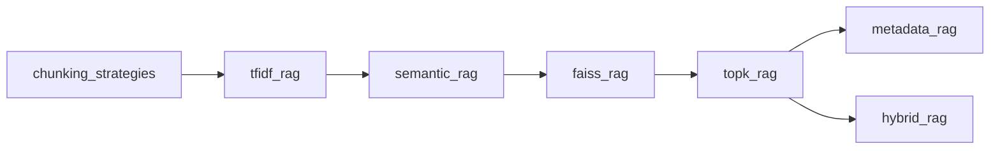

# 🧠 RAG Lab — Hands-On Retrieval-Augmented Generation

A collection of **8 progressive RAG implementations** exploring different retrieval, chunking, and search strategies — from basic TF-IDF to hybrid semantic+keyword fusion, all powered by DeepSeek and built with FAISS, SentenceTransformers, and scikit-learn.

---

## 📁 Project Structure

```
RAG_Learning/
├── documents/                  # Shared knowledge base
│   └── portal.txt             # Customer portal FAQ (single source of truth)
│
├── llm/                       # Shared LLM module (DeepSeek via OpenAI SDK)
│   └── llm.py
│
├── chunking_strategies/       # 🔹 Chunking comparison (no LLM)
│   ├── compare.py             # Side-by-side comparison runner
│   ├── fixed_chunker.py       # Fixed-size chunking
│   ├── overlap_chunker.py     # Sliding-window with overlap
│   └── paragraph_chunker.py   # Paragraph-based splitting
│
├── tfidf_rag/                 # 🔹 Sparse TF-IDF retrieval (no LLM)
│   ├── main.py
│   ├── chunker.py
│   ├── embeddings.py          # TfidfVectorizer
│   └── vector_store.py        # sklearn cosine similarity
│
├── semantic_rag/              # 🔹 Dense semantic search (no LLM)
│   ├── main.py
│   ├── chunker.py
│   ├── embeddings.py          # SentenceTransformer (MiniLM)
│   └── vector_store.py        # Manual numpy cosine similarity
│
├── topk_rag/                  # 🔹 Configurable top-k FAISS RAG + LLM
│   ├── main.py                # Tunable retrieval depth (k)
│   ├── chunker.py
│   ├── embeddings.py
│   ├── faiss_store.py         # FAISS IndexFlatL2
│   └── retriever.py
│
├── faiss_rag/                 # 🔹 FAISS semantic RAG + LLM
│   ├── main.py                # Full pipeline: chunk → embed → index → retrieve → LLM
│   ├── chunker.py
│   ├── embeddings.py
│   ├── faiss_store.py         # FAISS IndexFlatL2
│   └── retriever.py
│
├── metadata_rag/              # 🔹 Metadata-filtered RAG + LLM
│   ├── main.py                # Pre-filter chunks by structured metadata
│   ├── chunker.py
│   ├── embeddings.py
│   ├── faiss_vector_store.py
│   ├── metadata_store.py      # Filter by project/module tags
│   └── retriever.py
│
├── hybrid_rag/                # 🔹 Hybrid search (semantic + keyword, no LLM)
│   ├── main.py                # Weighted fusion: 80% semantic + 20% keyword
│   ├── chunker.py
│   ├── embeddings.py
│   ├── semantic_search.py     # Cosine similarity
│   ├── keyword_search.py      # Word-overlap scoring
│   └── hybrid_search.py       # Fusion & ranking
│
├── requirements.txt
├── .env                       # DEEPSEEK_API_KEY (gitignored)
└── README.md
```

---

## 🚀 Quick Start

```bash
# 1. Clone & enter the project
git clone <repo-url>
cd RAG_Learning

# 2. Create virtual environment
python -m venv .venv
.venv\Scripts\activate   # Windows
# source .venv/bin/activate  # macOS/Linux

# 3. Install dependencies
pip install -r requirements.txt

# 4. Add your DeepSeek API key
echo DEEPSEEK_API_KEY="sk-your-key-here" > .env

# 5. Run any RAG pipeline
python faiss_rag/main.py        # FAISS semantic search + LLM
python topk_rag/main.py         # Configurable top-k FAISS retrieval + LLM
python metadata_rag/main.py     # Metadata-filtered retrieval + LLM
python semantic_rag/main.py     # Pure semantic similarity (no LLM)
python tfidf_rag/main.py        # TF-IDF keyword matching (no LLM)
python hybrid_rag/main.py       # Hybrid semantic + keyword fusion
python chunking_strategies/compare.py  # Chunking strategy comparison
```

---

## 🔬 What Each Pipeline Demonstrates

| Pipeline | Retrieval | Index | LLM | Key Concept |
|---|---|---|---|---|
| `chunking_strategies` | — | — | ❌ | Fixed vs. overlap vs. paragraph chunking |
| `tfidf_rag` | Sparse TF-IDF | sklearn cosine | ❌ | Lexical/word-level matching |
| `semantic_rag` | Dense embeddings | numpy cosine | ❌ | Meaning-aware semantic similarity |
| `faiss_rag` | Dense embeddings | FAISS Flat L2 | ✅ DeepSeek | Scalable vector search + answer generation |
| `topk_rag` | Dense embeddings | FAISS Flat L2 | ✅ DeepSeek | Configurable retrieval depth (top-k tuning) |
| `metadata_rag` | Filtered dense | FAISS Flat L2 | ✅ DeepSeek | Pre-filtering by structured metadata |
| `hybrid_rag` | Semantic + keyword | custom fusion | ❌ | Weighted ensemble retrieval |

---

## 🧩 Shared Components

- **Embedding Model** — All dense pipelines use `all-MiniLM-L6-v2` (384-dim) via SentenceTransformers
- **LLM** — All LLM pipelines use `deepseek-chat` via the OpenAI-compatible SDK
- **Documents** — All pipelines query the same `documents/portal.txt` (a small customer portal FAQ)

---

## 📊 Learning Progression



1. **Chunking** — Understand how text splitting affects retrieval quality
2. **TF-IDF** — See the limits of keyword matching
3. **Semantic Search** — See how embeddings capture meaning beyond words
4. **FAISS + LLM** — Wire up a complete end-to-end RAG pipeline
5. **Metadata Filtering** — Narrow retrieval by structured attributes
6. **Hybrid Search** — Fuse multiple signals for better ranking

---

## 🔑 Environment

Create a `.env` file at the project root:

```env
DEEPSEEK_API_KEY="sk-your-deepseek-api-key"
```

Get a key from [platform.deepseek.com](https://platform.deepseek.com).

---

## 📦 Dependencies

- **Embeddings:** `sentence-transformers`, `torch`, `transformers`
- **Vector Search:** `faiss-cpu`, `numpy`, `scipy`
- **TF-IDF:** `scikit-learn`
- **LLM:** `openai`, `python-dotenv`

See [`requirements.txt`](requirements.txt) for the full frozen list.

---

## 📝 License

MIT — use it, learn from it, build on it.
